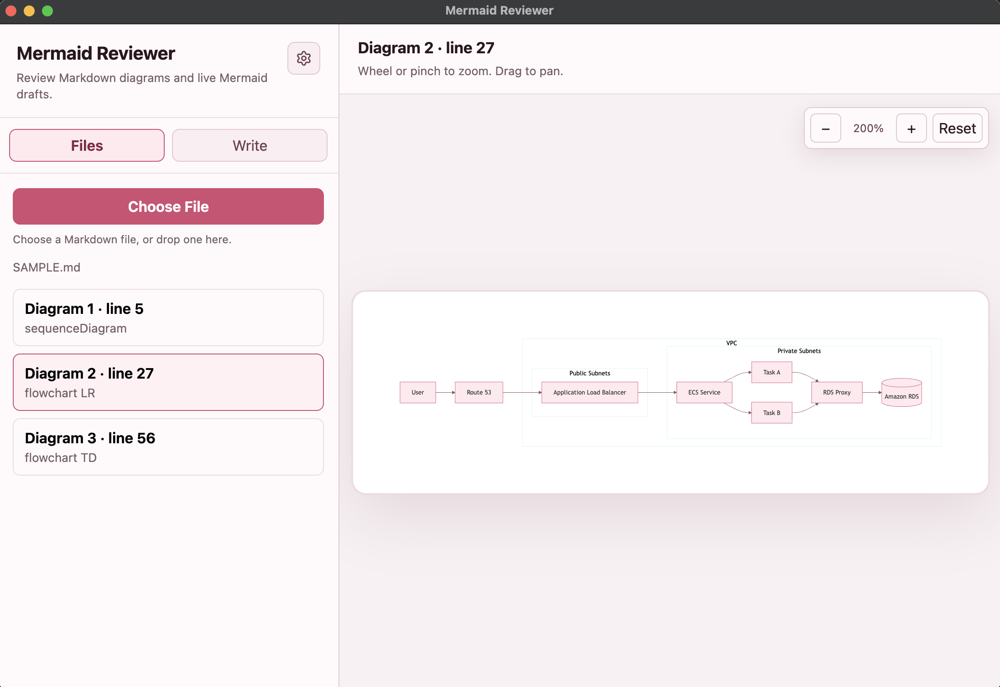

# Mermaid Reviewer

A Deno Desktop Mermaid live viewer for previewing and reviewing diagrams from
Markdown or direct input.



## Requirements

- Deno v2.9.0 or later
- A macOS environment that can run `deno desktop`

## Quick Start

Clone the repository and run the desktop task from the project root.

```sh
git clone <repository-url>
cd reviwers
deno task desktop
```

On first run, Deno downloads the npm dependencies pinned in `deno.json`.

`deno task desktop` is the standard launch command. It builds the Vite app, then
runs Deno Desktop with `desktop.ts` as the explicit entrypoint.

If you want to call `deno desktop` directly, build first and pass the entrypoint
yourself:

```sh
deno task build
deno desktop --allow-read --allow-write --allow-env=HOME --include=./dist --output ./build/MermaidReviewerCEF.app desktop.ts
```

## CLI

You can install the `reviwers` command globally:

```sh
deno task install:cli
```

Then launch the app from any directory:

```sh
reviwers .
reviwers ./SAMPLE.md
```

The argument can be a Markdown file or a directory containing Markdown files. If
a directory is provided, the app loads the first `.md` or `.markdown` file it
finds. On macOS, the CLI builds `./build/MermaidReviewerCEF.app` and opens it
with `open`.

## Features

- Extract Mermaid code blocks from Markdown files
- Switch between multiple Mermaid diagrams in a file
- Write Mermaid directly and preview it live
- Zoom, pinch, pan, and reset the diagram view
- Change the color schema from the settings menu
- Persist settings in `~/.reviewers/settings.json`
- Open Markdown from the CLI with `reviwers .` or `reviwers ./file.md`

## Layout

The app uses a two-pane layout.

- Left pane
  - `Files` tab: choose a Markdown file or drop one into the app
  - `Write` tab: write Mermaid directly
- Right pane
  - Rendered Mermaid diagram
  - Zoom and pan controls
- Header settings menu
  - Color schema selection

Future versions may add an LLM chat area for diagram review assistance.

## Development

Launch the desktop app:

```sh
deno task desktop
```

Development and verification commands:

```sh
deno task dev
deno task build
deno task preview
deno task desktop:hmr
deno task desktop:webview
deno task install:cli
deno test
```

The UI is built with Vite. `index.html` and `vite.config.ts` are used for normal
Vite development. For Deno Desktop, `desktop.ts` serves the built `dist/`
directory over local HTTP.

Deno Desktop's default WebView backend currently does not handle the file picker
correctly for this app, so `deno.json` configures the official launch path to
use the CEF backend:

```sh
deno task desktop
```

For backend comparison, WebView output is still available:

```sh
deno task desktop:webview
```

The desktop window starts at `1100x760`.

The macOS app icon source is `assets/icon.png` and must be a 1024x1024 PNG.
`deno task icon:macos` generates `assets/icon.icns`; the normal desktop and CLI
launch flows run this step automatically.

## Settings

Settings are stored locally at:

```text
~/.reviewers/settings.json
```

Current settings:

```json
{
  "colorScheme": "graphite",
  "summary": [
    {
      "path": "/Users/example/docs/spec.md",
      "lastUsedAt": "2026-07-18T01:23:45.000Z"
    }
  ]
}
```

Changing the color schema automatically saves the setting and restores it on the
next launch. Markdown files selected in the desktop app are listed below the
file button for quick reopening and can be removed from the list. Desktop launch
tasks include `--allow-write`, `--allow-run=osascript`, and `--allow-env=HOME`
for this.

## Dependencies

Dependencies are pinned in `deno.json` imports. `package.json` only contains
minimal metadata and npm-compatible scripts for Vite/Deno Desktop detection.

Main dependencies:

- Deno Desktop
- Preact
- Vite
- Mermaid
- lucide-preact

## Documents

- [FEATURE.md](./FEATURE.md): feature specification
- [PLAN.md](./PLAN.md): implementation plan
- [SAMPLE.md](./SAMPLE.md): sample Mermaid diagrams
