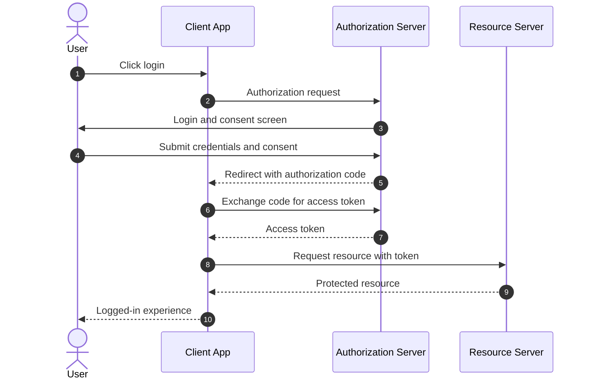
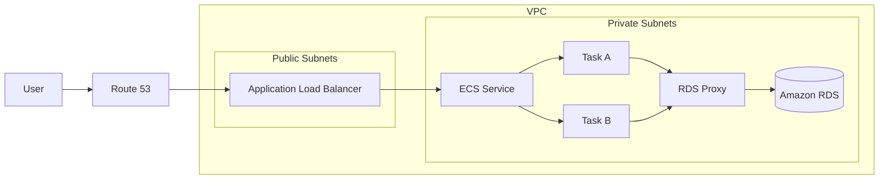
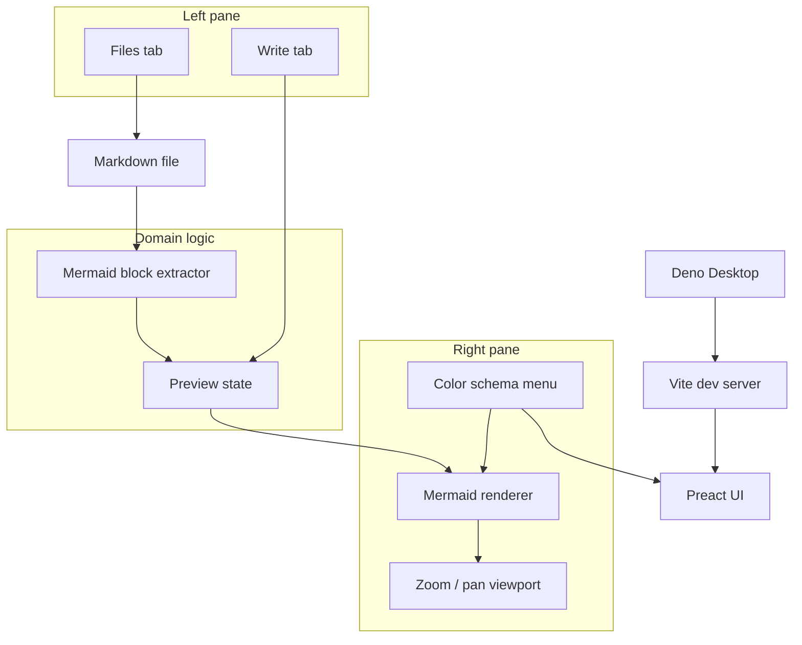

# Mermaid Reviewer Samples

## 1. OAuth 2.0 Login Flow

```mermaid
sequenceDiagram
  autonumber
  actor User
  participant App as Client App
  participant Auth as Authorization Server
  participant API as Resource Server

  User->>App: Click login
  App->>Auth: Authorization request
  Auth->>User: Login and consent screen
  User->>Auth: Submit credentials and consent
  Auth-->>App: Redirect with authorization code
  App->>Auth: Exchange code for access token
  Auth-->>App: Access token
  App->>API: Request resource with token
  API-->>App: Protected resource
  App-->>User: Logged-in experience
```

## 2. AWS ALB to ECS to RDS

```mermaid
flowchart LR
  User[User] --> Route53[Route 53]
  Route53 --> ALB[Application Load Balancer]

  subgraph VPC[VPC]
    subgraph Public[Public Subnets]
      ALB
    end

    subgraph Private[Private Subnets]
      ECS[ECS Service]
      TaskA[Task A]
      TaskB[Task B]
      Proxy[RDS Proxy]
      RDS[(Amazon RDS)]
    end
  end

  ALB --> ECS
  ECS --> TaskA
  ECS --> TaskB
  TaskA --> Proxy
  TaskB --> Proxy
  Proxy --> RDS
```

## 3. Mermaid Reviewer Architecture

```mermaid
flowchart TD
  Desktop[Deno Desktop] --> Vite[Vite dev server]
  Vite --> UI[Preact UI]

  subgraph LeftPane[Left pane]
    Files[Files tab]
    Write[Write tab]
  end

  subgraph Domain[Domain logic]
    Extractor[Mermaid block extractor]
    State[Preview state]
  end

  subgraph RightPane[Right pane]
    Renderer[Mermaid renderer]
    Viewport[Zoom / pan viewport]
    Theme[Color schema menu]
  end

  Files --> Markdown[Markdown file]
  Markdown --> Extractor
  Extractor --> State
  Write --> State
  State --> Renderer
  Theme --> UI
  Theme --> Renderer
  Renderer --> Viewport
```
